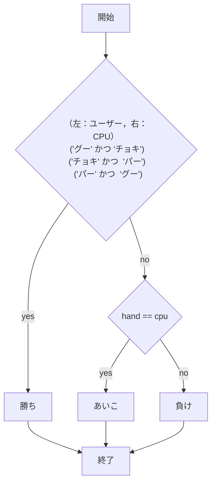
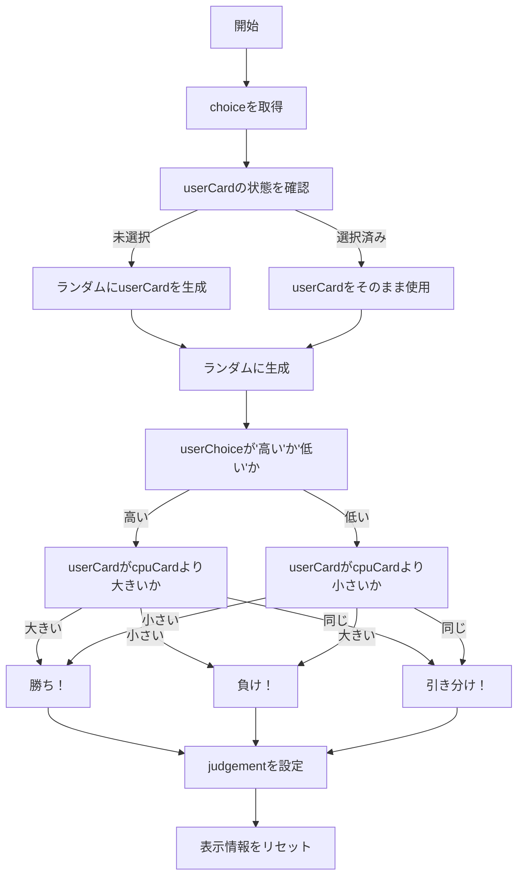
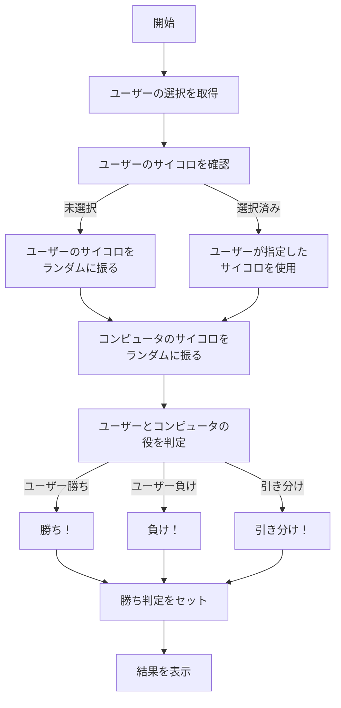

# webpro_06


## app5.js使用書
---
## `hello` 関数
1. `app5.js` を起動する  
1. Webブラウザで `localhost:8080/hello1` または `localhost:8080/hello2` にアクセスする  
1. 挨拶を確認する  

| ファイル名       | 説明                           |
|------------------|--------------------------------|
| `app5.js`        | プログラム本体                 |
| `views/show.ejs` | 挨拶文を表示するテンプレート   |

---

## `icon` 関数  
1. `app5.js` を起動する  
1. Webブラウザで `localhost:8080/icon` にアクセスする  
1. アイコン画像とその説明文が表示される  

| ファイル名       | 説明                           |
|------------------|--------------------------------|
| `app5.js`        | プログラム本体                 |
| `views/icon.ejs` | アイコン画像を表示するテンプレート |

---

## `luck` 関数  
1. `app5.js` を起動する  
1. Webブラウザで `localhost:8080/luck` にアクセスする  
1. サイコロの目と運勢が表示される  

| ファイル名       | 説明                           |
|------------------|--------------------------------|
| `app5.js`        | プログラム本体                 |
| `views/luck.ejs` | 運勢結果を表示するテンプレート  |

---
## `janken` 関数
1. ```app5.js``` を起動する
1. Webブラウザでlocalhost:8080/public/janken.htmlにアクセスする
1. 自分の手を入力する

ファイル名 | 説明
-|-
app5.js | プログラム本体
public/janken.html | じゃんけんの開始画面
views / janken | じゃんけんのテンプレート

## フローチャート



---


## `hiandlo` 関数

### 概要  
この関数は，「Hi and Lo」ゲームを実装している．
ユーザーは「Hi」か「Lo」を選び，ランダムに引いたカードの数字をもとにコンピュータと対戦する．
ゲームが終了するたびに結果を表示し，ユーザーに「もう一度プレイ」が押されたら再度ゲームを開始する．

| **関数名**            | **説明**                                            | **型**   | **備考**                                                                 |
|----------------------|-----------------------------------------------------|--------|------------------------------------------------------------------------|
| `req.query.choice`    | ユーザーが選んだ「Hi」または「Lo」を示す文字列         | 文字列  | ユーザーが選んだ選択肢（"hi" または "lo"）                     |
| `req.query.userCard`  | ユーザーが選んだカード        | 整数    | ユーザーがカードを指定した場合，その値を使用する|


### 処理の流れ  
1. ユーザーが「Hi」または「Lo」を選択する．  
2. ユーザーとコンピュータそれぞれのカードをランダムに引く（1〜13の範囲）．  
3. ユーザーが選んだ「Hi」または「Lo」に基づき，勝敗を判定する．  
4. ゲームの結果（勝ち，負け，引き分け）を表示．  
5. ユーザーが「もう一度プレイ」ボタンを押すと，再度カードを引き直し，結果を再計算．

### 使用例  

```javascript  
// サーバーが起動した状態で，URLにアクセスする  
// 例: http://localhost:8000/hiandlo  

```
## フローチャート


---
## `chinchiro` 関数

### 概要
この関数は，チンチロゲームを簡易化したものを実装している．
ユーザーはサイコロを3つ振り，その結果に基づいてコンピュータとの対戦を行う．
ゲームの結果は役に応じて勝敗が決まり，ユーザーに結果が表示される．
ユーザーが「もう一度プレイ」を押すことで，サイコロを再度振り直して再ゲームされる．

| **関数名**        | **説明**                                           | **型**   | **備考**        |
|-------------------|--------------------------------------------------|--------|----------------|
| `req.query.choice` | ユーザーが選んだゲームの選択を示す文字列                     | 文字列  | ユーザーが選んだ選択肢|
| `req.query.userDice` | ユーザーが指定したサイコロの目を文字列で受け取る    | 文字列  | ユーザーが「もう一度プレイ」ボタンを押した場合，サイコロの目を指定して再度使用． |
| `userDice`        | ユーザーのサイコロの目                                      | 配列    | 1〜6の範囲のランダムな整数値．サイコロの目が3つ格納される． |
| `cpuDice`         | コンピュータのサイコロの目                                    | 配列    | 1〜6の範囲のランダムな整数値．コンピュータのサイコロの目が3つ格納される． |
| `judgement`       | ゲーム結果の判定メッセージ                                  | 文字列  | 勝敗の結果を示す文字列（勝ち，負け，引き分け）|

### 処理の流れ
1. ユーザーが選んだサイコロの目（`userDice`）を取得。指定がない場合はランダムに生成する．
2. コンピュータのサイコロもランダムに3つ振る．
3. ユーザーとコンピュータそれぞれのサイコロの目を元に役を判定する．
4. 役に基づいて勝敗を判定し、結果を表示する．
5. ユーザーが「もう一度プレイ」を押すと，再度サイコロを振り直して結果を再計算する．

### 使用例

```javascript
// サーバーが起動した状態で、URLにアクセスする
// 例: http://localhost:8000/chinchiro
```


