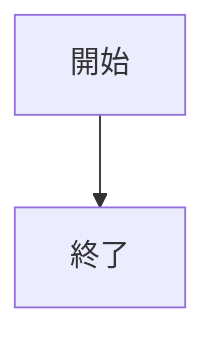
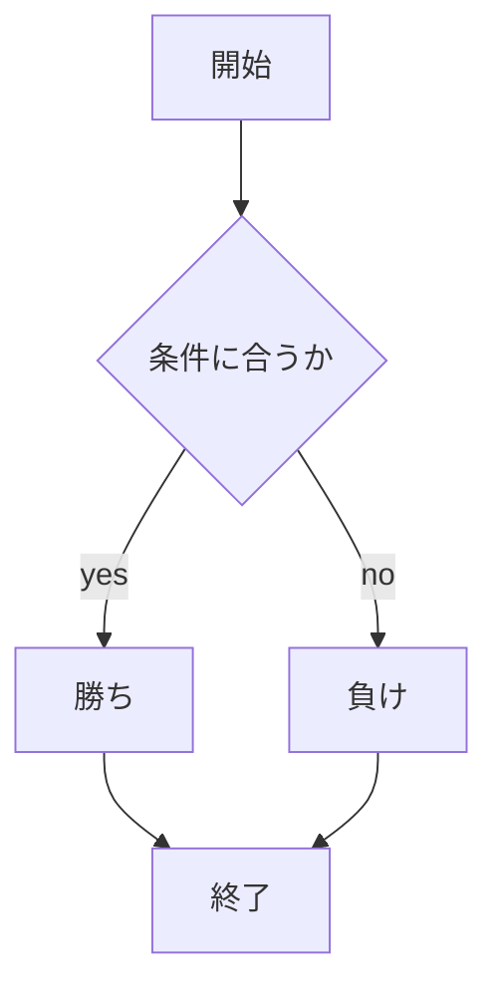
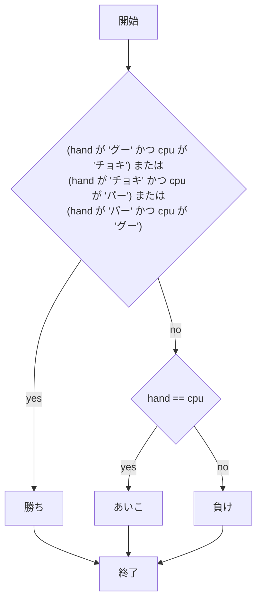

# webpro_06
# お腹すいた〜〜〜〜〜〜〜〜〜〜
(# 見出し)
## このプロフラムについて
## ファイル一覧

ファイル名 | 説明
-|-
app5.js | プログラム本体
public/janken.html | じゃんけんの開始画面
views / janken | じゃんけんのテンプレート

```javascript
console.log("Hello");
```
## 使用手順
1. ```app5.js``` を起動する
1. Webブラウザでlocalhost:8080/public/janken.htmlにアクセスする
1. 自分の手を入力する





